<h2>TensorFlow-FlexUNet-Image-Segmentation-Triple-Negative-Breast-Cancer (2025/08/27)</h2>

This is the first experiment of Image Segmentation for Triple Negative Breast Cancer (TNBC)
 based on our 
 <a href="https://github.com/sarah-antillia/TensorFlow-FlexUNet-Image-Segmentation-Model">
<b>TensorFlowFlexUNet (TensorFlow Flexible UNet Image Segmentation Model for Multiclass)</b></a>
, and a 512x512 pixels 
<a href="https://drive.google.com/file/d/17B1gmovVrPStwtov59Oau7VXUqp6Q3RT/view?usp=sharing">
<b>TNBC-PNG-ImageMask-Dataset.zip</b></a>.
which was derived by us from 
  
<a href="https://zenodo.org/records/2579118/preview/TNBC_NucleiSegmentation.zip?include_deleted=0#tree_item0">
 TNBC_NucleiSegmentation.zip
</a> in 
<a href="https://zenodo.org/records/2579118"><b>Segmentation of Nuclei in Histopathology Images by deep regression of the distance map</b></a>
 
 
On the TNBC-ImageMask-Dataset, please refer to our repository 
<a href="https://github.com/sarah-antillia/ImageMask-Dataset-Triple-Negative-Breast-Cancer">ImageMask-Dataset-Triple-Negative-Breast-Cancer</a>

 
Please see also our experiment for a singleclass segmentation model 
<a href="https://github.com/sarah-antillia/Tensorflow-Image-Segmentation-Triple-Negative-Breast-Cancer">
Tensorflow-Image-Segmentation-Triple-Negative-Breast-Cancer
</a>
 
 
As demonstrated in <a href="https://github.com/sarah-antillia/TensorFlow-FlexUNet-Image-Segmentation-STARE-Retinal-Vessel">
TensorFlow-FlexUNet-Image-Segmentation-STARE-Retinal-Vessel</a> ,
 our Multiclass TensorFlowFlexUNet, which uses categorized masks, can also be applied to 
single-class image segmentation models. 
This is because it inherently treats the background as one category and your single-class mask data as 
a second category. In essence, your single-class segmentation model will operate with two categorized classes within our Multiclass UNet framework.
 
 
<b>Acutual Image Segmentation for 512x512 TNBC images</b> 

As shown below, the inferred masks predicted by our segmentation model trained on the 
PNG dataset appear similar to the ground truth masks.
 
<table>
<tr>
<th>Input: image</th>
<th>Mask (ground_truth)</th>
<th>Prediction: inferred_mask</th>
</tr>
<tr>
<td>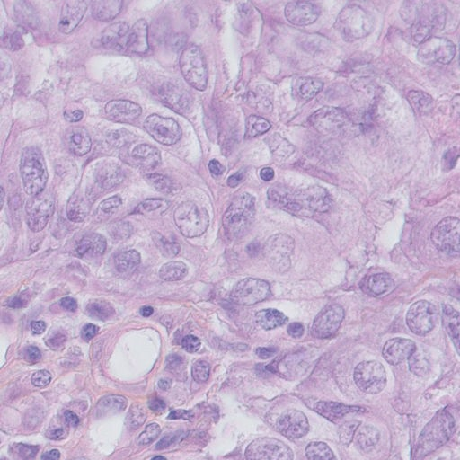</td>
<td>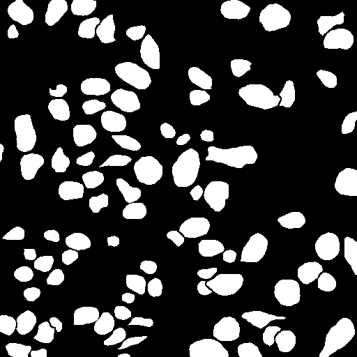</td>
<td>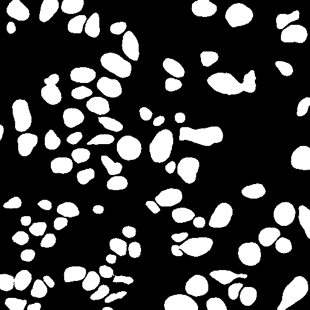</td>
</tr>
<tr>
<td>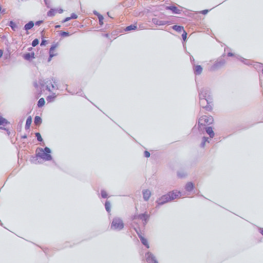</td>
<td>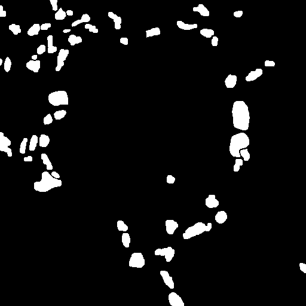</td>
<td>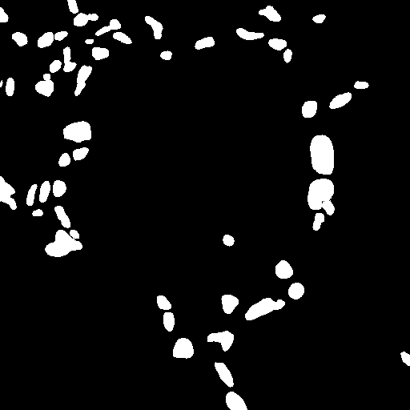</td>
</tr>
<tr>
<td>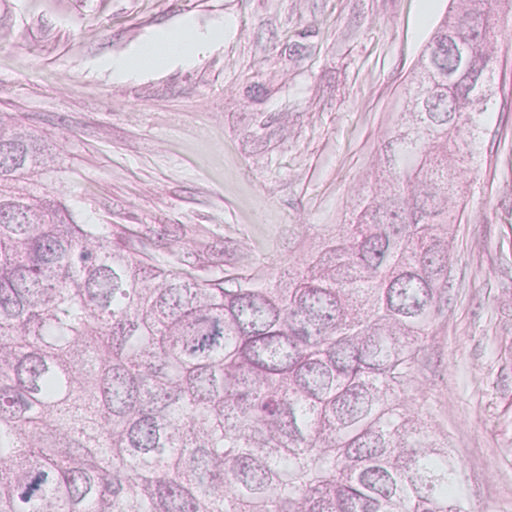</td>
<td>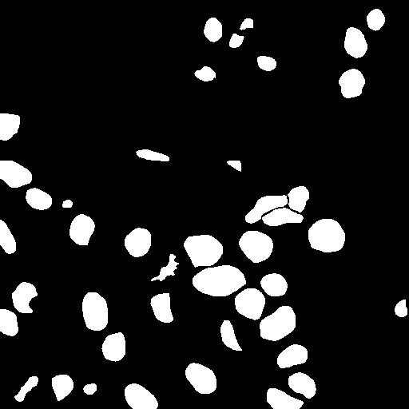</td>
<td></td>
</tr>
</table>

 
<h3>1. Dataset Citation</h3>
The original dataset used here has been taken from the following web site. 
<a href="https://zenodo.org/records/2579118"><b>Segmentation of Nuclei in Histopathology Images by deep regression of the distance map</b></a>
 
Published February 16, 2018 | Version 1.1 
 
<b>Creators</b> 
Naylor Peter Jack,Walter Thomas, Laé Marick, Reyal Fabien 
 
<b>Description</b> 
This dataset has been announced in our accepted paper "Segmentation of Nuclei in Histopathology Images  
by deep regression of the distance map" in Transcation on Medical Imaging on the 13th of August. 
This dataset consists of 50 annotated images, divided into 11 patients. 
 
 
v1.1 (27/02/19): Small corrections to a few pixel that were labelled nuclei but weren't. 
 

 
<h3>
<a id="2">
2 TNBC ImageMask Dataset
</a>
</h3>
 If you would like to train this TNBC Segmentation model by yourself,
 please download the dataset from the google drive  
<a href="https://drive.google.com/file/d/17B1gmovVrPStwtov59Oau7VXUqp6Q3RT/view?usp=sharing">
<b>TNBC-PNG-ImageMask-Dataset.zip</b></a>.
 
, expand the downloaded ImageMaskDataset and put it under <b>./dataset</b> folder to be
<pre>
./dataset
└─TNBC
    ├─test
    │   ├─images
    │   └─masks
    ├─train
    │   ├─images
    │   └─masks
    └─valid
        ├─images
        └─masks
</pre>
 
<b>TNBC Statistics</b> 
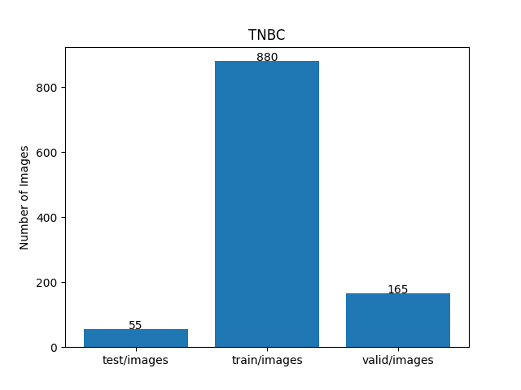 
 

On the derivation of the augmented dataset, please refer to the following Python scripts: 
<li><a href="./generator/ImageMaskDatasetGenerator.py">ImageMaskDatasetGenerator.py</a></li>
<li><a href="./generator/split_master.py">split_master.py</a></li>
 

As shown above, the number of images of train and valid datasets is large enough to use for a training set of our segmentation model.
 
 
<b>Train_images_sample</b> 
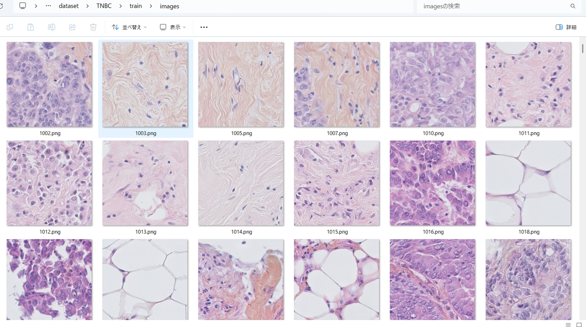
 
<b>Train_masks_sample</b> 
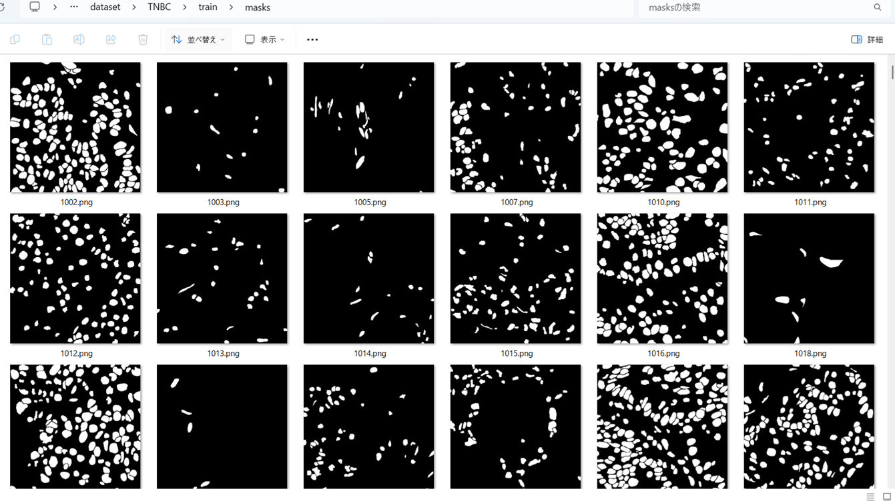
 
<h3>
3 Train TensorFlowFlexUNet Model
</h3>
 We trained TNBC TensorFlowFlexUNet Model by using the following
<a href="./projects/TensorFlowFlexUNet/TNBC/train_eval_infer.config"> <b>train_eval_infer.config</b></a> file.  
Please move to ./projects/TensorFlowFlexUNet/TNBC and run the following bat file. 
<pre>
>1.train.bat
</pre>
, which simply runs the following command. 
<pre>
>python ../../../src/TensorFlowFlexUNetTrainer.py ./train_eval_infer.config
</pre>

<b>Model parameters</b> 
Defined a small <b>base_filters = 16 </b> and large <b>base_kernels = (9,9)</b> for the first Conv Layer of Encoder Block of 
<a href="./src/TensorFlowFlexUNet.py">TensorFlowFlexUNet.py</a> 
and a large num_layers (including a bridge between Encoder and Decoder Blocks).
<pre>
[model]
;You may specify your own UNet class derived from our TensorFlowFlexModel
model         = "TensorFlowFlexUNet"
generator     =  False
image_width    = 512
image_height   = 512
image_channels = 3
num_classes    = 2

base_filters   = 16
base_kernels   = (9,9)
num_layers     = 8
dropout_rate   = 0.04
dilation       = (1,1)
</pre>
<b>Learning rate</b> 
Defined a very small learning rate.  
<pre>
[model]
learning_rate  = 0.00007
</pre>
<b>Loss and metrics functions</b> 
Specified "categorical_crossentropy" and <a href="./src/dice_coef_multiclass.py">"dice_coef_multiclass"</a>. 
<pre>
[model]
loss           = "categorical_crossentropy"
metrics        = ["dice_coef_multiclass"]
</pre>
<b>Dataset class</b> 
Specifed <a href="./src/ImageCategorizedMaskDataset.py">ImageCategorizedMaskDataset</a> class. 
<pre>
[dataset]
class_name    = "ImageCategorizedMaskDataset"
</pre>
 
<b>Learning rate reducer callback</b> 
Enabled learing_rate_reducer callback, and a small reducer_patience.
<pre> 
[train]
learning_rate_reducer = True
reducer_factor     = 0.4
reducer_patience   = 4
</pre>
<b>Early stopping callback</b> 
Enabled early stopping callback with patience parameter.
<pre>
[train]
patience      = 10
</pre>

<b>RGB Color map</b> 
rgb color map dict for TNBC 1+1 classes. 
<pre>
[mask]
mask_file_format = ".png"
; 1+1 classes
; RGB colors     TNBC;white     
rgb_map = {(0,0,0):0,(255,255,255):1,}
</pre>

<b>Epoch change inference callback</b> 
Enabled <a href="./src/EpochChangeInferencer.py">epoch_change_infer callback (EpochChangeInferencer.py)</a></b>. 
<pre>
[train]
epoch_change_infer       = True
epoch_change_infer_dir   =  "./epoch_change_infer"
num_infer_images         = 6
</pre>

By using this callback, on every epoch_change, the inference procedure can be called
 for 6 images in <b>mini_test</b> folder. This will help you confirm how the predicted mask changes 
 at each epoch during your training process.    

<b>Epoch_change_inference output at starting (epoch 1,2,3)</b> 
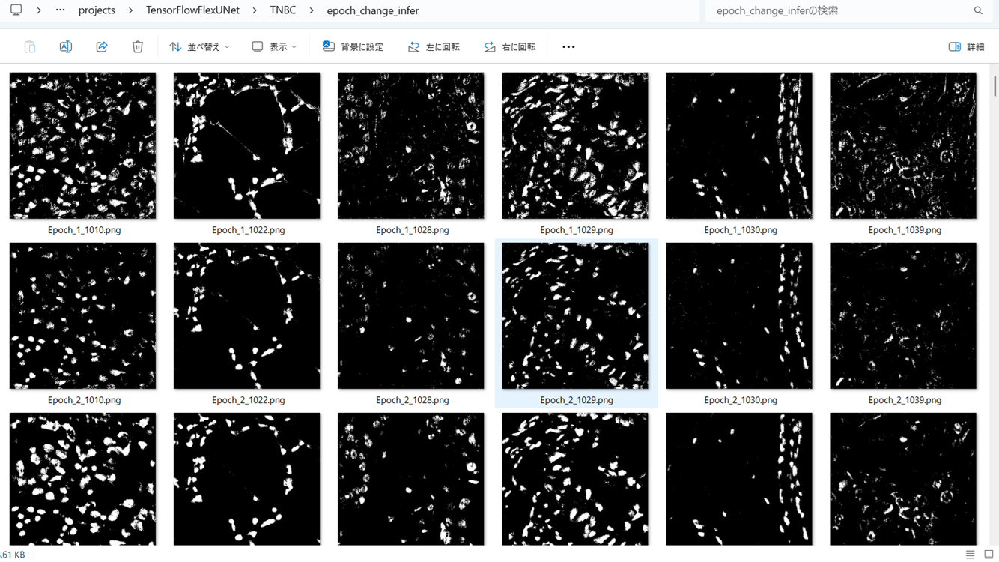 
 
<b>Epoch_change_inference output at middlepoint (epoch 30,31,32)</b> 
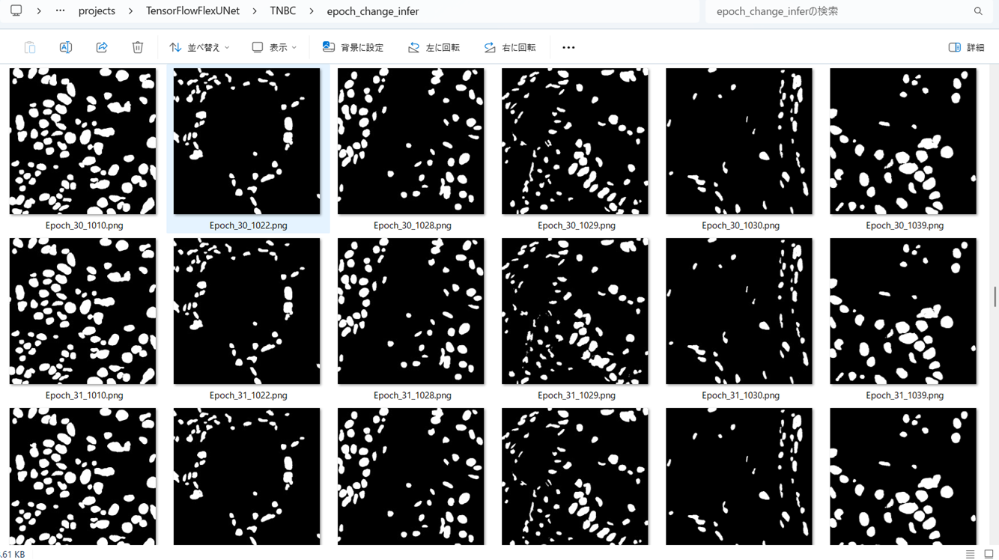 
 
<b>Epoch_change_inference output at ending (epoch 61,62,63)</b> 
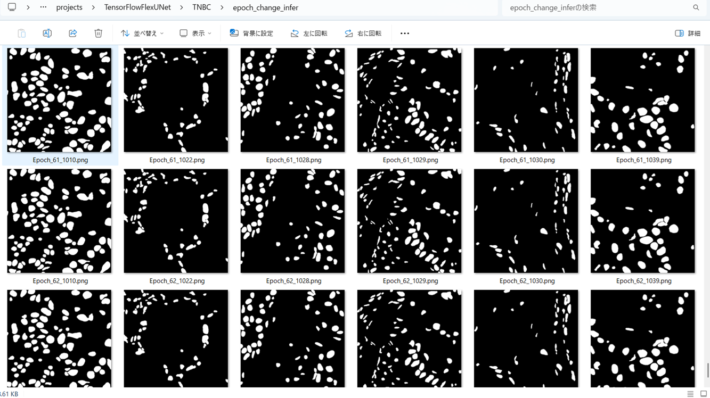 
 
In this experiment, the training process was stopped at epoch 63 by EarlyStoppingCallback.  
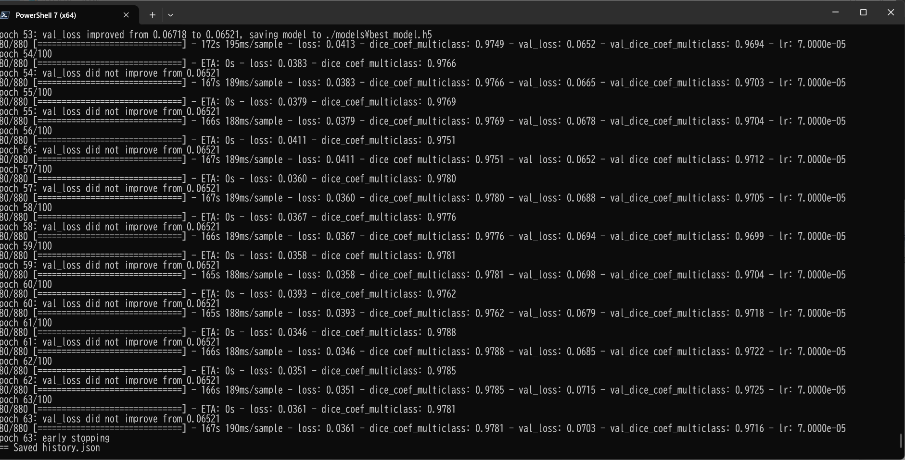 
 

<a href="./projects/TensorFlowFlexUNet/TNBC/eval/train_metrics.csv">train_metrics.csv</a> 
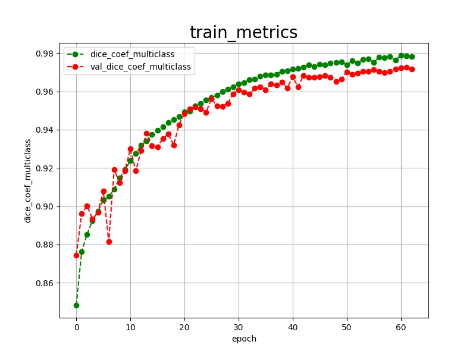 

 
<a href="./projects/TensorFlowFlexUNet/TNBC/eval/train_losses.csv">train_losses.csv</a> 
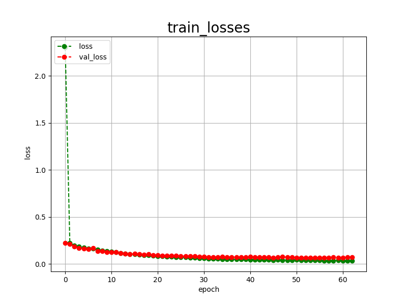 

 

<h3>
4 Evaluation
</h3>
Please move to <b>./projects/TensorFlowFlexUNet/TNBC</b> folder, 
and run the following bat file to evaluate TensorFlowFlexUNet model for TNBC. 
<pre>
./2.evaluate.bat
</pre>
This bat file simply runs the following command.
<pre>
python ../../../src/TensorFlowFlexUNetEvaluator.py ./train_eval_infer_aug.config
</pre>

Evaluation console output: 
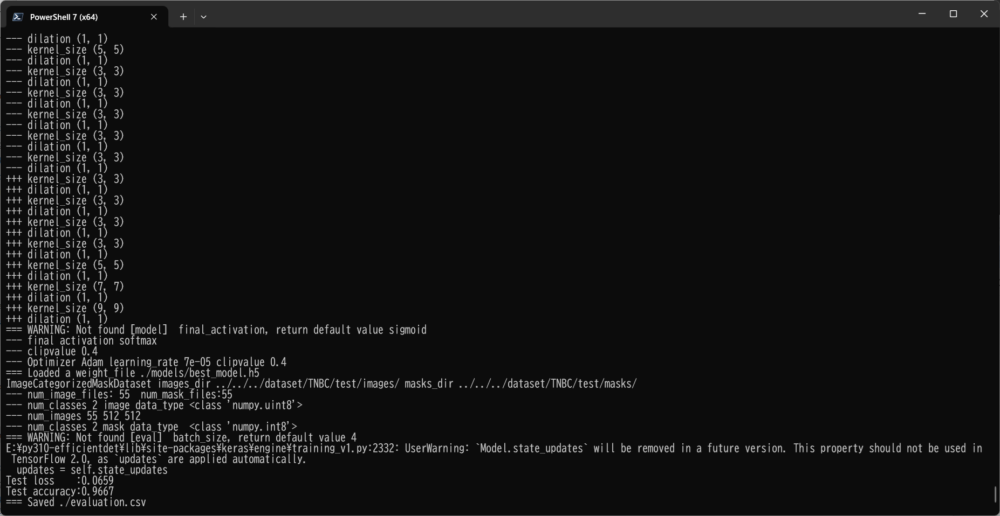
  

<a href="./projects/TensorFlowFlexUNet/TNBC/evaluation.csv">evaluation.csv</a> 
The loss (categorical_crossentropy) to this TNBC/test was low and dice_coef_multiclass 
high as shown below.
 
<pre>
categorical_crossentropy,0.0659
dice_coef_multiclass,0.9667
</pre>
 

<h3>
5 Inference
</h3>
Please move <b>./projects/TensorFlowFlexUNet/TNBC</b> folder 
,and run the following bat file to infer segmentation regions for images by the Trained-TensorFlowFlexUNet model for TNBC. 
<pre>
./3.infer.bat
</pre>
This simply runs the following command.
<pre>
python ../../../src/TensorFlowFlexUNetInferencer.py ./train_eval_infer_aug.config
</pre>

<b>mini_test_images</b> 
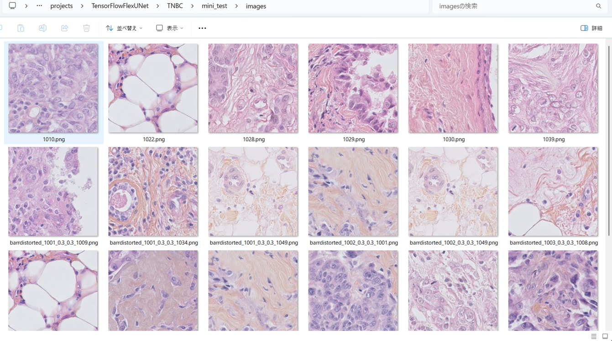 
<b>mini_test_mask(ground_truth)</b> 
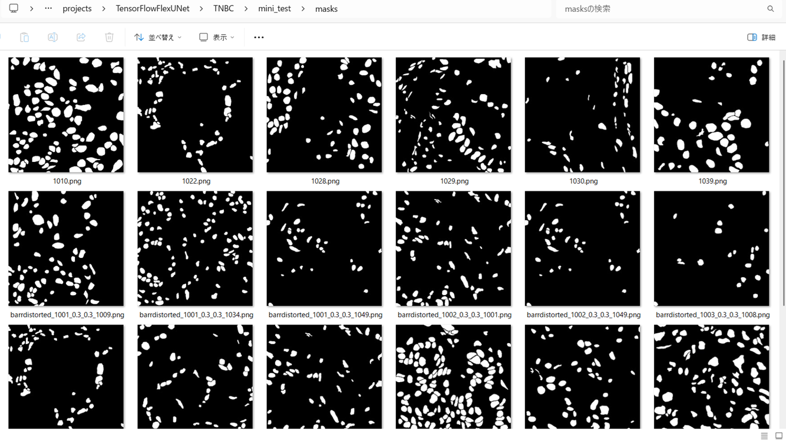 

<b>Inferred test masks</b> 
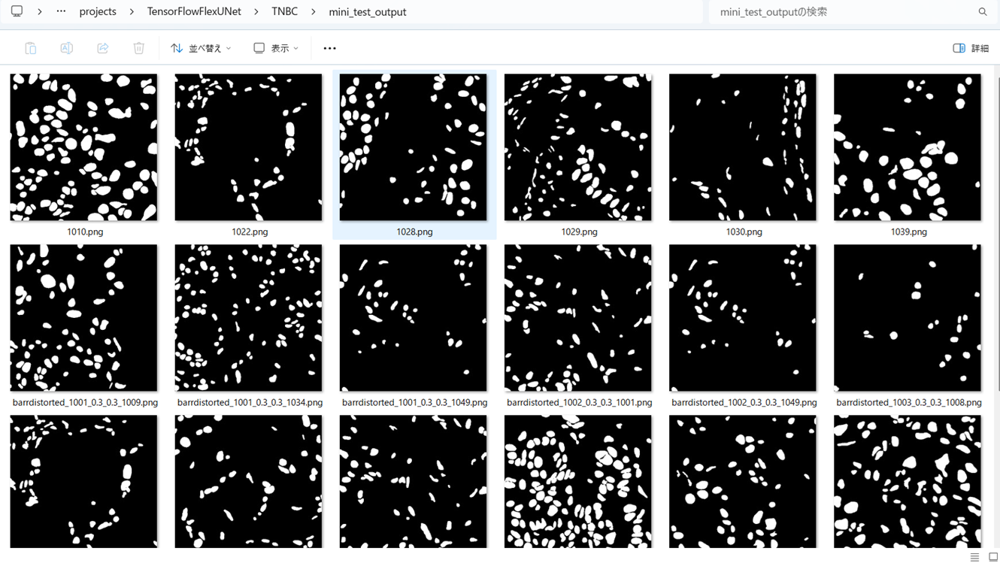 
 

<b>Enlarged images and masks of 512x512 pixels</b> 
<table>
<tr>
<th>Image</th>
<th>Mask (ground_truth)</th>
<th>Inferred-mask</th>
</tr>

<tr>
<td>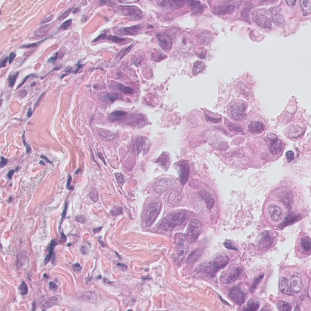</td>
<td>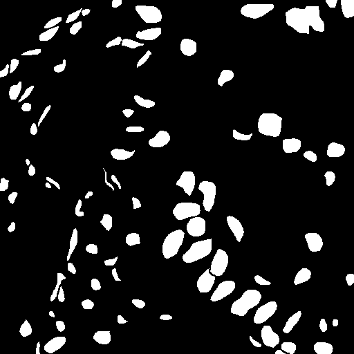</td>
<td></td>
</tr>

<tr>
<td></td>
<td></td>
<td></td>
</tr>

<tr>
<td>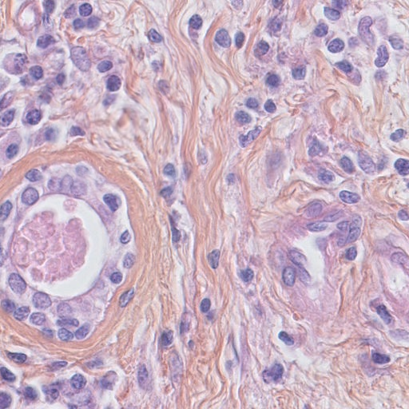</td>
<td></td>
<td>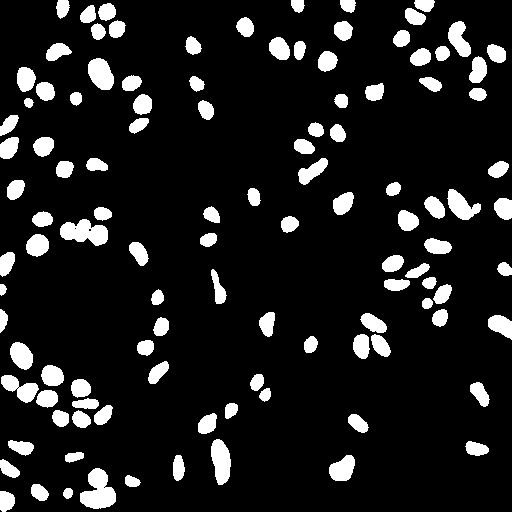</td>
</tr>

<tr>
<td>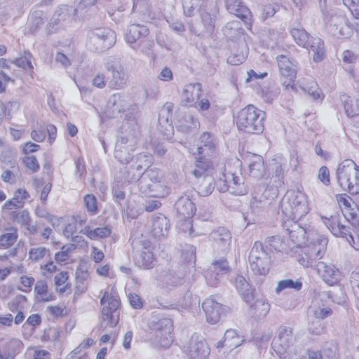</td>
<td>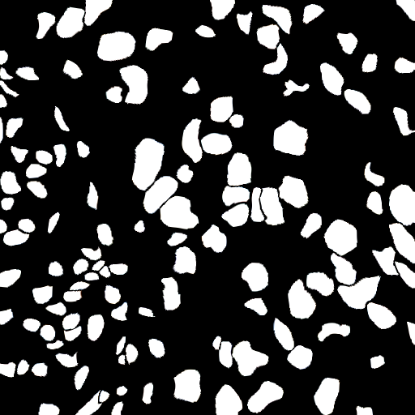</td>
<td></td>
</tr>

<tr>
<td>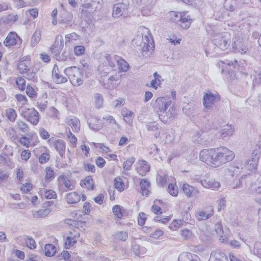</td>
<td>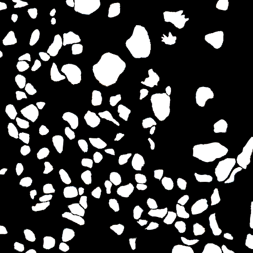</td>
<td>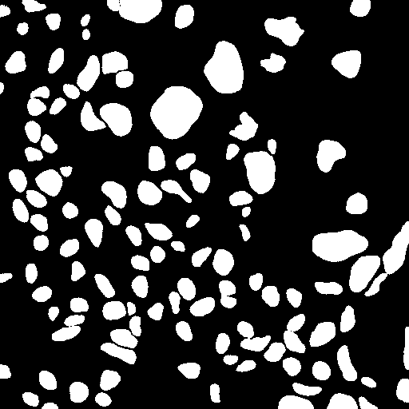</td>
</tr>

<tr>
<td>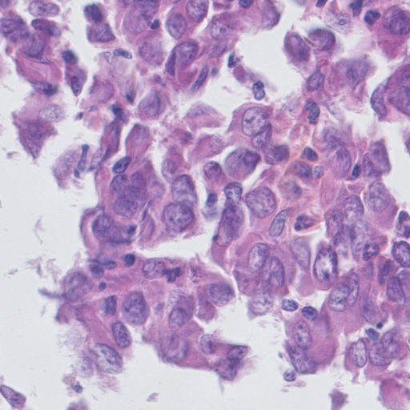</td>
<td>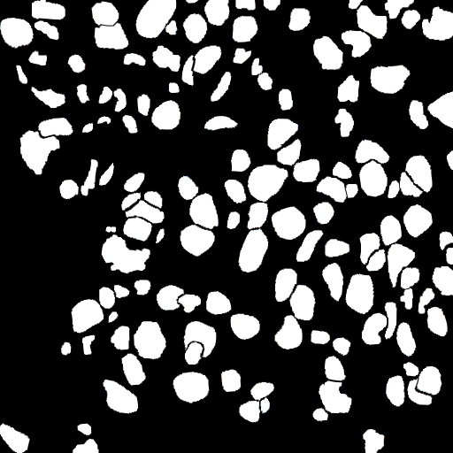</td>
<td>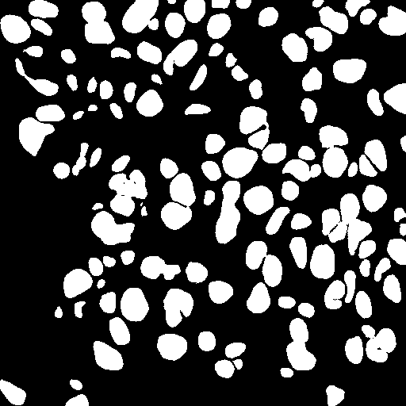</td>
</tr>
</table>

 
<h3>
References
</h3>
<b>1. Triple negative breast cancer: Pitfalls and progress</b> 
npj Breast Cancer volume 8, Article number: 95 (2022)  
Paola Zagami & Lisa Anne Carey 
<a href="https://www.nature.com/articles/s41523-022-00468-0">
https://www.nature.com/articles/s41523-022-00468-0
</a>
 
 
<b>2. A Large-scale Synthetic Pathological Dataset for Deep Learning-enabled  
Segmentation of Breast Cancer</b> 
Scientific Data volume 10, Article number: 231 (2023)  
Kexin Ding, Mu Zhou, He Wang, Olivier Gevaert, Dimitris Metaxas & Shaoting Zhang 
<a href="https://www.nature.com/articles/s41597-023-02125-y">
https://www.nature.com/articles/s41597-023-02125-y
</a>
 
 
<b>3. A review and comparison of breast tumor cell nuclei segmentation performances 
 using deep convolutional neural networks</b> 
 Scientific Reports volume 11, Article number: 8025 (2021)  
 Andrew Lagree, Majidreza Mohebpour, Nicholas Meti, Khadijeh Saednia, Fang-I. Lu, 
Elzbieta Slodkowska, Sonal Gandhi, Eileen Rakovitch, Alex Shenfield,  
Ali Sadeghi-Naini & William T. Tran 
<a href="https://www.nature.com/articles/s41598-021-87496-1">
https://www.nature.com/articles/s41598-021-87496-1
</a>

